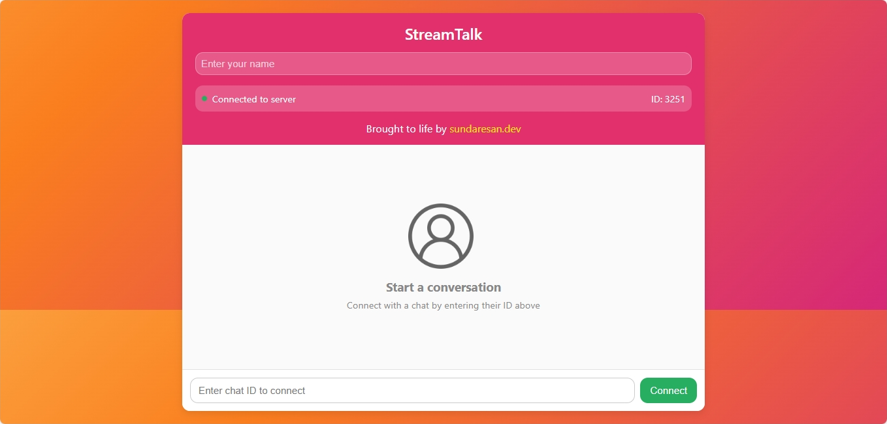

# StreamTalk - Peer-to-Peer Web Chat Application

 
*(Screenshot placeholder - replace with your actual screenshot)*

StreamTalk is a lightweight, browser-based peer-to-peer chat application that allows users to connect directly without servers. Built with PeerJS, it features colorful gradients, message history, typing indicators, and customizable usernames.

## Features ✨

- 🚀 **Instant P2P connections** - Connect directly between browsers
- 🔢 **Simple 4-digit IDs** - Easy to share and remember
- 🎨 **Colorful animated background** - Gradient that cycles through colors
- ✏️ **Custom usernames** - Set your display name for each chat
- ✍️ **Typing indicators** - See when others are typing
- 📱 **Responsive design** - Works on desktop and mobile devices
- ⏱️ **Message timestamps** - See when messages were sent
- 🔄 **Connection status** - Visual indicators for connection state

## How It Works 🔧

StreamTalk uses PeerJS to establish WebRTC connections between browsers. The application:
1. Generates a random 4-digit ID for each user
2. Allows connecting to other users by entering their ID
3. Establishes a direct P2P connection when both parties connect
4. Encrypts messages during transmission (via WebRTC security)
5. Displays messages with sender names and timestamps

## Installation & Usage 🚀

No installation needed! StreamTalk runs directly in the browser:

1. Open the [live demo](https://sundaresan-dev.github.io/stream-talk/) 
2. Your unique 4-digit ID will be displayed
3. Share your ID with a friend or enter theirs to connect
4. Start chatting!

