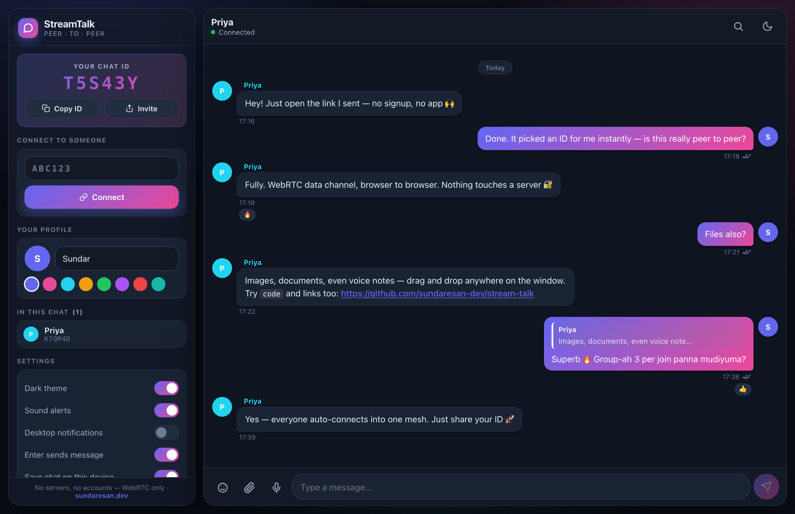

# StreamTalk — Peer-to-Peer Web Chat

<p align="center">
  
</p>

<p align="center">
  <a href="https://sundaresan-dev.github.io/stream-talk/">
    
  </a>
  
  
</p>

StreamTalk is a chat app that has no server behind it. Open the page, get a six-character
ID, share it, and every message, file and voice note travels **directly between the two
browsers** over a WebRTC data channel. There is no account, no database, and no message
of yours sitting on someone else's disk.

The whole app is **one `index.html`** — no build step, no framework, no npm install.
Drop it on GitHub Pages, a USB stick, or any static host and it works.

## Features

**Chat**
- 💬 Real-time text with sender avatars, message grouping and timestamps
- 👥 **Group chat** — peers auto-discover each other and form a mesh, so a third person only needs one ID
- ↩️ **Reply** to any message with an inline quote you can tap to jump back
- 😀 **Reactions** (hover on desktop, long-press on mobile) + an emoji picker
- ✍️ Live typing indicator and ✓✓ read receipts
- 🔍 **Search** the conversation (`/` to focus)

**Sharing**
- 🖼️ **Images** with inline previews and a full-screen lightbox
- 📎 **Any file** up to 60 MB, chunked with a live progress bar
- 🎙️ **Voice notes** recorded straight in the browser
- 🫳 **Drag & drop** anywhere on the window, or paste an image from the clipboard

**Everything else**
- 🌗 Dark & light theme, remembered per device
- 📱 Genuinely mobile-friendly — drawer navigation, safe-area insets, keyboard-aware composer
- 🔗 **Invite links** (`#YOURID`) that auto-connect, plus native share sheet on mobile
- 🔔 Sound alerts, desktop notifications and an unread badge in the tab title
- 💾 Optional local history + one-click transcript export
- ⌨️ Keyboard-first: `Enter` send, `Shift+Enter` newline, `/` search, `Esc` dismiss
- ♿ Focus rings, ARIA switches, `prefers-reduced-motion` support

## How to use

1. Open the [live demo](https://sundaresan-dev.github.io/stream-talk/) — an ID like `T5S43Y` appears immediately.
2. Hit **Invite** to copy a link, or read your ID out to a friend.
3. They paste it into **Connect** (or just open your link) and you are talking.

To run it yourself:

```bash
git clone https://github.com/sundaresan-dev/stream-talk.git
cd stream-talk
python3 -m http.server 8000     # any static server works
```

## How it works

```
Browser A  ──── signalling handshake ────►  PeerJS broker  ◄──── Browser B
    │                                                              │
    └──────────── encrypted WebRTC data channel ───────────────────┘
                        (messages · files · audio)
```

A public PeerJS broker is used **once**, only to introduce the two browsers to each
other. After that the data channel is direct and DTLS-encrypted; the broker never sees
a message. Chat history, if you enable it, stays in your own `localStorage`.

Incoming message text is HTML-escaped before rendering, so a message containing markup
is shown as text and never executed.

**Limits worth knowing:** both people must be online at the same time (there is no
inbox), a few strict corporate or carrier NATs will block a direct connection since no
TURN relay is configured, and large files are held in memory while transferring.

## Tech

Vanilla HTML, CSS and JavaScript. [PeerJS](https://peerjs.com/) for the WebRTC
handshake. No dependencies to install, no bundler, no backend.

---

Built by [sundaresan.dev](https://github.com/sundaresan-dev) · MIT
